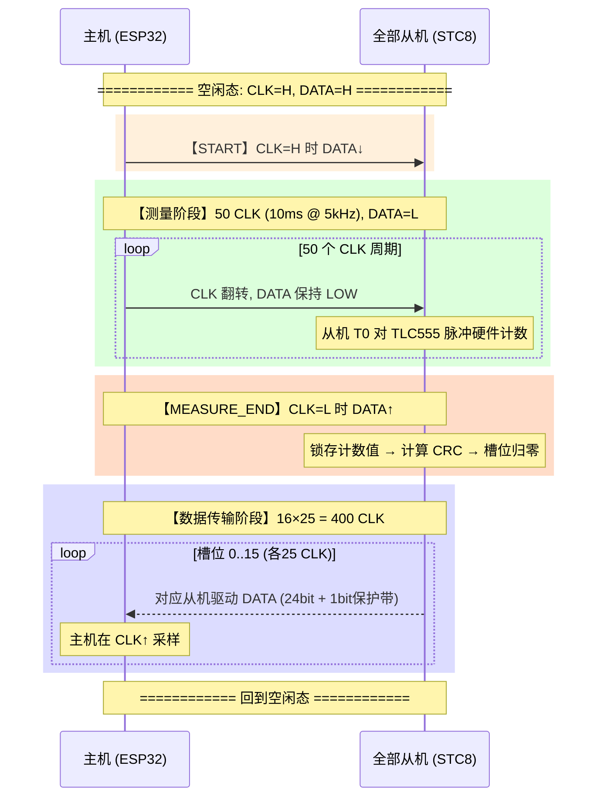
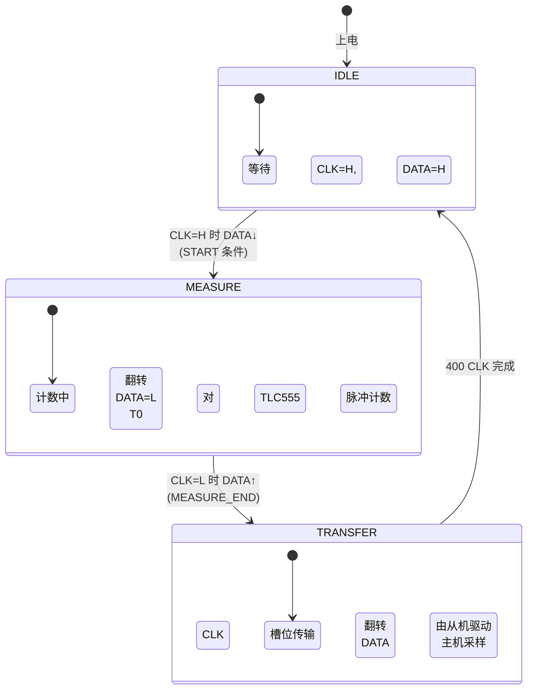

# 主机-从机通信协议规范 v1.2

> **文档日期**: 2026-07-22  
> **适用项目**: ESP32 自动灌溉系统  
> **参考文件**: `water.ino`, 从机固件 `slave.c`

---

## 目录

1. [系统概述](#1-系统概述)
2. [物理层](#2-物理层)
3. [协议帧结构](#3-协议帧结构)
4. [相位详解](#4-相位详解)
5. [数据格式](#5-数据格式)
6. [错误处理](#6-错误处理)
7. [时序汇总](#7-时序汇总)
8. [从机固件设计要点](#8-从机固件设计要点)
9. [主机固件设计要点](#9-主机固件设计要点)
10. [供电设计](#10-供电设计)
11. [决策日志](#11-决策日志)
12. [附录](#12-附录)

---

## 1. 系统概述

### 1.1 拓扑结构

```
                    4芯总线 (VCC, GND, CLK, DATA)
    ┌─────────┐      ───┬──────────────┬──      ──────────────
    │ ESP32   │         │              │         │  从机 #0..#15
    │ (主机)  │────┬────┼────── 5m ────┼────┬───│  STC8G1K17A
    │         │    │    │              │    │   │  + TLC555
    │ 3.3V    │    │   [从机#0]     [从机#1]  │  + 土壤探头
    │ 电平转换 │────┼────┼── 0.5m ────┼────┼───│
    └─────────┘    │    │     ...      │    │   │
                   │   [从机#14]    [从机#15]  │
                   └────┴─────────────┴────┴───│
                        总线全长: ~12.5m       └── 最多 16 台
```

- **主机**: ESP32（3.3V 系统），经电平转换电路接入 5V 总线
- **从机**: STC8G1K17A (SOP-8)，每台配 TLC555 非稳态振荡器 + PCB 叉指土壤探头，详见 `docs/slave-design.md`
- **总线**: 4 芯线缆 (VCC / GND / CLK / DATA)，串联所有设备
- **从机地址**: 编译时固化为 0~15，每地址一台设备

### 1.2 协议设计原则

| 原则 | 说明 |
|------|------|
| 单主多从 | ESP32 独占总线控制权 |
| 两阶段帧 | 先测量（从机各自采样），后传输（依次回传） |
| 时间槽 | 从机按固件地址占用传输槽位，无需地址仲裁 |
| 类 SPI 时序 | CLK 下降沿更新数据，CLK 上升沿采样 |
| 开漏双向数据线 | DATA 线多设备共享，上拉至 5V |

---

## 2. 物理层

### 2.1 电平转换方案

ESP32 为 3.3V 系统，总线为 5V，需在两个方向上作电平转换。CLK 为单向（ESP32→总线），DATA 为双向。统一使用 BSS138 N-MOSFET 实现，BOM 单一。

```
                    主机端 PCB                           │  4芯总线          │  从机侧
                                                        │                   │
  ESP32 (3.3V)         电平转换电路         5V 节点       │                   │
 ┌────────────┐    ┌──────────────────┐                 │                   │
 │            │    │                  │                 │                   │
 │ GPIO14 ────│────│── BSS138_CLK ────│──[100Ω]────────│─ CLK ──[100Ω]────│─ P3.2
 │ (CLK,推挽)  │    │    Source        │  Drain          │                   │
 │            │    │    Gate ── 3.3V   │  [4.7kΩ→5V]    │                   │
 │            │    │                  │                 │                   │
 │ GPIO27 ────│────│── BSS138_DATA ───│──[100Ω]────────│─ DATA ─[220Ω/台]─│─ P3.3
 │ (DATA,开漏) │    │    Source        │  Drain          │                   │
 │            │    │    [4.7kΩ→3.3V]  │  [10kΩ→5V]     │                   │
 │            │    │    Gate ── 3.3V  │                 │                   │
 │            │    │                  │                 │                   │
 │ 3.3V ──────│────│── 两个 BSS138 ──│                 │                   │
 │            │    │    Gate 公共节点  │                 │                   │
 │            │    │                  │                 │                   │
 │ GND ───────│────│─────────────────│─────────────────│─ GND ───────────│─ GND
 └────────────┘    └──────────────────┘                 │                   │
                                                        │                   │
                                                        │  5V ─────────────│─ VCC (从机)
                                                        │  (来自LM2596S)   │
```

### 2.1.1 主机端详细接线图

下图仅展示主机 PCB 上的电平转换电路，以面包板/PCB 布线视角绘制每条连接：

```
                         ┌────────── 3.3V 轨 (ESP32 板载)
                         │
                    ┌────┴────────────────────┐
                    │                         │
                    │    ┌─── R1 ───┐          │
                    │    │  4.7kΩ   │          │
                    │    │          │          │
                    │    ├──────────┼──────────┤
                    │    │          │          │
                    │    │    ┌─────┤          │
                    │    │    │     │          │
ESP32               │    │    │     │          │
┌──────────┐        │  ┌─┴─────┴─┐   │          │
│ GPIO14   │────────│──│ S  D    │   │          │
│ (CLK)    │        │  │ BSS138  │   │          │
│ 推挽输出  │        │  │  (CLK)  │   │          │
│          │        │  │ G       │   │          │
├──────────┤        │  └────┬────┘   │          │
│ GPIO27   │────────│───────│────────┤          │
│ (DATA)   │        │       │   ┌────┴────┐     │
│ 开漏模式  │        │       │   │ S     D │     │
│          │        │       │   │ BSS138  │     │
├──────────┤        │       │   │  (DATA)  │     │
│ 3.3V     │────────│───────┴───│ G       │     │
│          │        │           └────┬────┘     │
├──────────┤        │                │          │
│ GND      │────────│────────────────│──────────│── GND 总线
└──────────┘        │                │          │
                    └────────────────│──────────┘
                                     │
                    ┌────────────────┘
                    │
          ┌─────────┴────────── 5V 轨 (LM2596S 输出)
          │
     ┌────┴────┐          ┌────┴────┐
     │ R2      │          │ R3      │
     │ 4.7kΩ   │          │ 10kΩ    │
     └────┬────┘          └────┬────┘
          │                    │
          ├─ BSS138_CLK Drain  │
          │                    ├─ BSS138_DATA Drain
          │  ┌── R_ser1 ──┐    │  ┌── R_ser2 ──┐
          ├──│   100Ω     │─→  ├──│   100Ω     │─→
          │  └────────────┘    │  └────────────┘
          │  CLK 输出到总线     │  DATA 输出到总线
          │                    │
          │                    │
    总线 CLK 线           总线 DATA 线
```

### 2.1.2 主机端各元件管脚接线说明

**BSS138_CLK (N-MOSFET, SOT-23, 单向 3.3V→5V 电平转换)**

| 管脚 | 编号 | 连接目标 | 说明 |
|------|:---:|------|------|
| Source (S) | ② | ESP32 GPIO14 (CLK, 推挽输出) | 3.3V 侧输入，GPIO14 直接驱动 |
| Gate (G) | ① | 3.3V 轨 + BSS138_DATA Gate 公共节点 | 固定接 3.3V，始终导通（Vgs≥0V 时体二极管反向截止） |
| Drain (D) | ③ | R2(4.7kΩ→5V) 上端 + R_ser1(100Ω) → 总线 CLK | 5V 侧开漏输出，经上拉电阻至 5V |

> SOT-23 封装：俯视印字面朝自己，从左到右为 ①Gate、②Source、③Drain。

**工作原理**：GPIO14 输出 LOW (0V) 时，Vgs=3.3V，MOSFET 导通，Drain 被拉到 ~0V；GPIO14 输出 HIGH (3.3V) 时，Vgs≈0V，MOSFET 截止，Drain 由 R2 上拉至 5V。由此实现 3.3V 推挽 → 5V 开漏的电平转换。

**BSS138_DATA (N-MOSFET, SOT-23, 双向 3.3V⇄5V 电平转换)**

| 管脚 | 编号 | 连接目标 | 说明 |
|------|:---:|------|------|
| Source (S) | ② | ESP32 GPIO27 (DATA, 开漏模式) + R1(4.7kΩ→3.3V) | 3.3V 侧双向节点，开漏驱动 + 上拉 |
| Gate (G) | ① | 3.3V 轨 | 固定接 3.3V |
| Drain (D) | ③ | R3(10kΩ→5V) 上端 + R_ser2(100Ω) → 总线 DATA | 5V 侧双向节点，开漏驱动 + 上拉 |

> 同一封装，脚位同 BSS138_CLK。

**双向工作原理**：
- **ESP32 驱动 LOW**：GPIO27 拉低 Source → Vgs=3.3V → MOSFET 导通 → Drain 也被拉到 ~0V → 总线 DATA=LOW
- **ESP32 释放 (高阻)**：Source 被 R1 上拉至 3.3V → Vgs≈0V → MOSFET 截止 → Drain 被 R3 上拉至 5V → 总线 DATA=HIGH
- **从机驱动 LOW**：总线 DATA 被从机拉低 → Drain=0V → 由于 Gate=3.3V，Vgd=3.3V，MOSFET 的体二极管 (D→S) 正向导通 → Source 被拉到 ~0.7V → ESP32 读到 LOW
- **从机释放 (高阻)**：总线 DATA 被 R3 上拉至 5V → Drain=5V → Vgs=3.3-3.3=0V → MOSFET 截止 → Source 被 R1 上拉至 3.3V → ESP32 读到 HIGH

**R1 (4.7kΩ, 0805, 3.3V 侧 DATA 上拉)**

| 焊盘 | 连接目标 | 说明 |
|------|------|------|
| 焊盘 A | 3.3V 轨 | 上拉电源端 |
| 焊盘 B | BSS138_DATA Source (②) + ESP32 GPIO27 | 当总线所有设备释放时，将 DATA 3.3V 侧拉到 HIGH |

**R2 (4.7kΩ, 0805, 5V 侧 CLK 上拉)**

| 焊盘 | 连接目标 | 说明 |
|------|------|------|
| 焊盘 A | 5V 轨 (LM2596S 输出) | 上拉电源端 |
| 焊盘 B | BSS138_CLK Drain (③) + R_ser1 | GPIO14=HIGH 时 MOSFET 截止，此电阻将 CLK 拉到 5V |

**R3 (10kΩ, 0805, 5V 侧 DATA 上拉)**

| 焊盘 | 连接目标 | 说明 |
|------|------|------|
| 焊盘 A | 5V 轨 (LM2596S 输出) | 上拉电源端 |
| 焊盘 B | BSS138_DATA Drain (③) + R_ser2 | 全部设备释放时，将 DATA 总线拉到 5V。仅主机端一处，从机不设 |

> R3 取值 10kΩ（而非 4.7kΩ）：总线 DATA 线上挂 16 台从机，每台开漏驱动时需对抗此上拉。10kΩ 使从机驱动电流仅 0.5mA/台，在 STC8 开漏能力内。上升时间 τ = 10kΩ × C_bus ≈ 10kΩ × 500pF = 5μs，5kHz 时钟下裕量充足。

**R_ser1 / R_ser2 (100Ω, 0805, 串联阻尼电阻)**

| 电阻 | 焊盘 A | 焊盘 B | 说明 |
|------|------|------|------|
| R_ser1 | BSS138_CLK Drain + R2 | 总线 CLK 端子 | CLK 线串联阻尼，抑制振铃 |
| R_ser2 | BSS138_DATA Drain + R3 | 总线 DATA 端子 | DATA 线串联阻尼，抑制从机反射 |

**总线连接器 (4 芯端子)**

| 端子 | 丝印 | 连接目标 | 线缆颜色建议 |
|------|:---:|------|:---:|
| 1 | VCC | 5V 轨 (LM2596S 输出，不经电平转换) | 红 |
| 2 | GND | ESP32 GND + 电平转换电路 GND 公共点 | 黑 |
| 3 | CLK | R_ser1 远端 (经 100Ω 后) | 黄 |
| 4 | DATA | R_ser2 远端 (经 100Ω 后) | 绿 |

### 2.2 引脚分配

| 设备 | 引脚 | 功能 | 方向 | 配置 |
|------|------|------|------|------|
| ESP32 | GPIO_xx | CLK | 输出 | 推挽 |
| ESP32 | GPIO_xx | DATA | 双向 | 开漏 / 输入 |
| STC8 | P3.2 (INT0) | CLK | 输入 | 准双向/高阻输入 |
| STC8 | P3.3 (INT1) | DATA | 双向 | 开漏 / 高阻 |
| STC8 | P5.4 (T0) | TLC555 脉冲 | 输入 | Timer0 外部计数模式 |

> STC8G1K17A 采用 SOP-8 封装，T0 映射到 P5.4(PIN1) 而非 SOP-16 的 P3.4。完整从机引脚分配见 `docs/slave-design.md`。
> ESP32 具体 GPIO 编号已在 `docs/pin-mapping.md` 中确定：CLK=GPIO14, DATA=GPIO27。

### 2.3 电气参数

| 参数 | 值 | 说明 |
|------|-----|------|
| 总线电压 | 5V | STC8 宽压兼容 |
| CLK 频率 | 5 kHz (典型) | 1~5kHz 可调 |
| CLK 占空比 | 50% | 200μs 周期, 100μs 半周期 |
| CLK 驱动方式 | 开漏 (BSS138) + 上拉 | 主机通过 BSS138 开漏驱动, 4.7kΩ 上拉至 5V |
| CLK 上升时间 (10→90%) | ~5μs (@ 500pF 总线电容) | 5kHz 下半周期 100μs, 裕量充足 |
| DATA 上拉 (总线侧) | 10kΩ → 5V | 仅主机端 |
| DATA 上拉 (3.3V 侧) | 4.7kΩ → 3.3V | BSS138 需要 |
| 线缆长度 | ≤ 15m (总线) | 主机→第一从机 ≤ 5m |
| 从机数量 | ≤ 16 | 地址 0~15 |
| 线缆规格 | 4 芯, ≥ 0.3mm²/芯 | ~22AWG |

---

## 3. 协议帧结构

### 3.1 帧组成



### 3.2 状态机



---

## 4. 相位详解

### 4.1 START 条件

```
         IDLE                       MEASURE
    ┌──────────┐               ┌──────────┐
CLK ─┘          └───────────────┘          └──  ← 主机驱动
         ┌──────┐
DATA ────┘      └─────────────────────────────  ← 主机拉低
         ↑
    CLK=H 时 DATA↓
```

| 项目 | 描述 |
|------|------|
| 触发 | CLK = HIGH 时，主机将 DATA 拉低 |
| 从机检测 | STC8 的 INT1 (P3.3) 配置为下降沿触发；在 ISR 中检查 CLK (P3.2) 是否为高。若 CLK=H 且 DATA 下降沿 → 确认为 START |
| 从机动作 | ① 清零 T0 计数器 (TLC555 脉冲计数) ② 设置内部 phase=MEASURE |
| 主机动作 | 拉低 DATA 后，延时 ~20μs，随后拉低 CLK，开始测量阶段 CLK 输出 |

**设计要点**: START 条件的关键是 CLK=HIGH 时 DATA 下降——这与 I2C START 条件相同，但这里不用于 I2C，仅作为帧起始标志。

### 4.2 测量阶段

| 项目 | 描述 |
|------|------|
| 时长 | **50 个 CLK 周期** (固定) |
| CLK | 主机以 5kHz (200μs 周期, 100μs 半周期) 翻转 |
| DATA | 主机全程驱动为 **LOW** |
| 从机动作 | STC8 的 Timer0 (T0, P5.4) 配置为 16 位外部脉冲计数器，硬件自动累加 TLC555 输出脉冲。**无需软件参与计数** |
| 测量窗口时长 | 50 ÷ 5000 = **10ms** |

**TLC555 脉冲计数范围**:

| 土壤状态 | TLC555 频率 | 10ms 内脉冲数 | 16 位上限 |
|---------|-----------|-------------|-----------|
| 湿土 (R小, C大) | ~50 kHz | ~500 | ✅ |
| 中等湿度 | ~200 kHz | ~2000 | ✅ |
| 干土 (R大, C小) | ~500 kHz | ~5000 | ✅ |
| 理论最大 (探头短路) | 若干 MHz | — | 并联电容限制 |

> 探头并联固定电容保证 TLC555 振荡频率不超过 ~600kHz（即使土壤完全干燥也不超过 65535 脉冲/10ms）。

### 4.3 MEASURE_END

```
         测量最后 CLK                      传输开始
    ┌──┐        ┌──┐        ┌──┐        ┌──┐
CLK ─┘  └────────┘  └────────┘  └────────┘  └──
               ↑
        CLK=L 时主机拉高 DATA
          ┌───────┐
DATA ─────┘       └───────────────────────────
          ↑
    从机检测 MEASURE_END
```

| 项目 | 描述 |
|------|------|
| 触发 | 主机在 **CLK = LOW** 时将 DATA 拉高 |
| 从机检测 | 在每次 CLK 下降沿后轮询 DATA (P3.3)；一旦读到 HIGH 即确认为 MEASURE_END |
| 从机动作 | ① 锁存 T0 计数值 → `pulse_count[15:0]` ② 计算 `crc = CRC8(pulse_count)` ③ 组装 24bit 数据 ④ 槽位计数器 `slot = 0` ⑤ DATA (P3.3) 切换为**开漏输出模式、输出高阻** |
| 主机动作 | 拉高 DATA 后立即将 DATA 引脚切为**输入模式**（高阻态），此后总线 DATA 由上拉电阻维持 HIGH。完成当前 CLK 周期后进入传输阶段 |

**为什么选择 CLK=LOW 时触发**: 5kHz 时钟下 LOW 半周期 = 100μs，STC8 (1MHz 内部 RC) 可执行约 100 条指令，足够完成锁存、CRC 计算（约 1000 条指令，在测量阶段后台已完成）、GPIO 模式切换等。

### 4.4 数据传输阶段

#### 4.4.1 槽位分配

每个从机分配 **25 个 CLK 周期** = 24 bit 数据 + 1 bit 保护带：

| 全局 CLK 序号 | 从机 N | 槽位内偏移 | 动作 |
|:---:|:---:|:---:|---|
| N×25 + 0 | N | 0 | 从机 N 驱动 bit[23] (MSB of pulse_count) |
| N×25 + 1 | N | 1 | 驱动 bit[22] |
| ... | ... | ... | ... |
| N×25 + 15 | N | 15 | 驱动 bit[8] (LSB of pulse_count) |
| N×25 + 16 | N | 16 | 驱动 bit[7] (MSB of CRC-8) |
| N×25 + 17 | N | 17 | 驱动 bit[6] |
| ... | ... | ... | ... |
| N×25 + 23 | N | 23 | 驱动 bit[0] (LSB of CRC-8) |
| N×25 + 24 | N | — | **保护带**: 从机 N 释放总线 (切高阻) |
| (N+1)×25 + 0 | N+1 | 0 | 从机 N+1 开始驱动 |

**共计**: 16 × 25 = **400 CLK** 传输全部数据。

#### 4.4.2 时钟边沿约定

```
CLK:   ____/‾‾‾‾‾\____/‾‾‾‾‾\____
             ↑         ↑
        ┌────┘         └────┐
        从机在 CLK↓     主机在 CLK↑
        更新 DATA       采样 DATA
```

| 边沿 | 方向 | 动作 |
|------|------|------|
| **CLK ↓** (下降沿) | 从机 → DATA | 从机更新下一位数据到 DATA 线 |
| **CLK ↑** (上升沿) | DATA → 主机 | 主机锁存当前 DATA 电平 |

这等价于 SPI Mode 0 (CPOL=0, CPHA=0)，在 5kHz 时钟下给每个 bit 提供约 100μs 建立时间和 100μs 保持时间，远大于线缆边沿退化时间。

#### 4.4.3 保护带时序

```
         bit0 (LSB)        保护带         bit23 (MSB, 下一槽位)
    ┌──┐       ┌──┐       ┌──┐       ┌──┐
CLK ─┘  └───────┘  └───────┘  └───────┘  └──

DATA ───X──────────X─────────────────────────
        ↑          ↑   ╲            ↑
        从机N      从机N ╲          从机N+1
        更新 bit0  释放   ╲ HIGH    驱动 MSB
                 总线     ╲(上拉)
```

| 阶段 | CLK 序号 | 从机 N 动作 | 从机 N+1 动作 | DATA 状态 |
|------|:---:|---|---|---|
| 数据传输 (bit0) | N×25+23 | CLK↓ 驱动 bit0 | 高阻, 等待 | 0 或 1 |
| 保护带开始 | N×25+24 | **CLK↓ 切为高阻** | 尚未轮到 | 被上拉 → HIGH |
| 保护带中间 | N×25+24 | 高阻 | 高阻 | HIGH |
| 下一槽位开始 | (N+1)×25+0 | 不参与 | **CLK↓ 驱动 bit23** | 数据 |

**保护带时长**: 1 个 CLK 周期 = 200μs @ 5kHz，远超 STC8 GPIO 模式切换时间 (~1μs)。

#### 4.4.4 从机驱动逻辑（伪代码描述）

从机内部维护一个 `slot_counter`，从 0 开始，在每个 CLK 下降沿递增。驱动判定如下：

```
if slot_counter >= MY_ADDR * 25 and slot_counter < MY_ADDR * 25 + 24:
    // 数据阶段: 驱动 DATA
    bit_index = 23 - (slot_counter - MY_ADDR * 25)
    set DATA = data_24bit[bit_index]
elif slot_counter == MY_ADDR * 25 + 24:
    // 保护带: 释放总线
    set DATA = HIGH_Z (input mode)
else:
    // 不是我的槽位: 不驱动
    set DATA = HIGH_Z (input mode)
```

---

## 5. 数据格式

### 5.1 24 bit 帧结构

```
┌──────────────────────────────────┬──────────────────────┐
│        pulse_count [15:0]        │     CRC-8 [7:0]      │
│         高位 (MSB) 先发           │     高位 (MSB) 先发    │
└──────────────────────────────────┴──────────────────────┘
  bit[23] ·············· bit[8]     bit[7] ······ bit[0]
```

| 字段 | 位宽 | 描述 |
|------|:---:|------|
| pulse_count | 16 bit | TLC555 脉冲计数值，10ms 测量窗口内累计 |
| CRC-8 | 8 bit | 对 pulse_count 的 CRC-8-Dallas 校验值 |

### 5.2 CRC-8 参数

| 参数 | 值 | 说明 |
|------|-----|------|
| 标准 | CRC-8-Dallas/Maxim | 与 1-Wire 设备相同 |
| 多项式 | **x⁸ + x⁵ + x⁴ + 1** | 二进制 `100110001`, 值 `0x31` (正向), `0x8C` (反转) |
| 初始值 | 0x00 | — |
| 输入异或 | 0x00 (不反转) | — |
| 输出异或 | 0x00 (不反转) | — |
| 计算范围 | pulse_count[15:0], 高字节在前 | 2 个字节 |

### 5.3 CRC-8 计算算法（字节级描述）

```
crc = 0x00

for byte in [pulse_count_high, pulse_count_low]:
    crc = crc XOR byte
    for i = 0 to 7:
        if crc AND 0x01:
            crc = (crc >> 1) XOR 0x8C
        else:
            crc = (crc >> 1)
```

STC8 (8051 内核) 实现此算法约需 ~80 字节 ROM，在 1MHz 下执行约 ~1000 个时钟周期 (~1ms)。可在测量阶段的后台完成，不影响传输。

### 5.4 特殊数据标记

| 数据 | 含义 | CRC 校验 |
|------|------|:---:|
| 0xFFFFFF (全 1) | 该地址无从机 / 总线拉高 | ❌ 必失败 |
| 0x000000 + 有效 CRC | 探头短路或 TLC555 无输出 | ✅ 通过 |
| 其他值 + 有效 CRC | 正常土壤湿度读数 | ✅ 通过 |
| 其他值 + 无效 CRC | 传输错误或从机故障 | ❌ 失败 |

---

## 6. 错误处理

### 6.1 错误场景与策略

| 场景 | 主机观察 | 判定条件 | 处理策略 |
|------|---------|---------|---------|
| 地址 N 无从机 | 槽位 N = 0xFFFFFF | CRC 不匹配 | 标记 `device_present[N] = false` |
| CRC 校验失败 | 某槽位 CRC 不匹配 | CRC ≠ 计算值 | 丢弃本次数据，保留上次有效读数 |
| 从机持续故障 | 连续 CRC 失败 | 连续 ≥ 3 次 | 标记 `device_fault[N] = true`, 触发告警 |
| 总线断线 | 全部 16 槽 = 0xFFFFFF | 连续 ≥ 2 帧 | 标记 `bus_fault = true`, 触发告警 |
| 从机看门狗复位 | DATA 异常拉低 | 单帧损坏 | 下帧自动恢复（START 同步所有从机） |
| TLC555 / 探头故障 | pulse_count = 0 | CRC 通过但计数为 0 | 标记 `sensor_fault[N] = true` |
| 协议不同步 | 槽位偏移、数据乱序 | 多槽 CRC 失败 | START 条件强制同步，不影响下帧 |

### 6.2 故障恢复

```mermaid
flowchart TD
    A[收到一帧数据] --> B{全16槽=0xFFFFFF?}
    B -->|是| C{bus_fault_count++}
    C --> D{count >= 2?}
    D -->|是| E[报警: 总线断线]
    D -->|否| Z[等待下一帧]
    
    B -->|否| F[逐槽 CRC 校验]
    F --> G{CRC 通过?}
    G -->|是| H{pulse_count == 0?}
    H -->|是| I[标记: 探头故障]
    H -->|否| J[更新有效读数, 清零故障计数]
    G -->|否| K{fault_count[N]++}
    K --> L{fault_count[N] >= 3?}
    L -->|是| M[报警: 从机N故障]
    L -->|否| N[保留上次有效值]
    
    Z --> A
    J --> A
    I --> A
    M --> A
    N --> A
    E --> A
```

---

## 7. 时序汇总

### 7.1 帧时序 (@ 5kHz)

```
┌──────────┬──────────┬──────────┬──────────┐
│  START   │  测量    │ MEASURE  │ 数据传输  │
│          │          │  _END    │          │
├──────────┼──────────┼──────────┼──────────┤
│  1 CLK   │ 50 CLK   │  1 CLK   │ 400 CLK  │
│  0.2ms   │  10ms    │  0.2ms   │  80ms    │
└──────────┴──────────┴──────────┴──────────┘
                       总计: ~90.4ms / 帧
             最大扫描速率: ~11 帧/秒
```

> 对土壤湿度监测而言，每秒 1 帧已完全满足需求。可在主机侧通过延时降低实际扫描速率以节省功耗。

### 7.2 各阶段 DATA 线驱动者

| 阶段 | CLK | DATA | CLK 驱动者 | DATA 驱动者 |
|------|:---:|:---:|---|---|
| IDLE | H | H (上拉) | — | — |
| START | H | H→L | 主机 | 主机 |
| MEASURE | 翻转 | L | 主机 | 主机 |
| MEASURE_END | L | L→H | 主机 | 主机→高阻 |
| TRANSFER | 翻转 | 数据 | 主机 | 各从机 (开漏) |
| IDLE | →H | →H | 主机 | 高阻→上拉 |

---

## 8. 从机固件设计要点

### 8.1 编译配置

```c
#define SLAVE_ADDR  0x05    // 地址 0~15, 每台从机不同
#define F_OSC       1000000 // 1MHz 内部 RC 振荡器
```

### 8.2 引脚配置

| 引脚 | 功能 | 模式 | 外设 |
|------|------|------|------|
| P3.2 | CLK 输入 | 准双向 / 高阻输入 | INT0 (备用) |
| P3.3 | DATA 双向 | 开漏输出 / 高阻输入 | INT1 (下降沿中断) |
| P5.4 | TLC555 脉冲输入 | 高阻输入 | T0 (16位计数器) |

### 8.3 外设配置

| 外设 | 配置 | 说明 |
|------|------|------|
| Timer0 | 16 位计数器模式, T0 引脚输入 | 硬件自动累加 TLC555 脉冲, 无需软件 |
| INT1 | 下降沿触发 | 用于检测 START 条件 (CLK=H 且 DATA↓) |
| 看门狗 | 使能, 超时 ~100ms | 防止从机死锁影响总线 |

### 8.4 主循环逻辑（伪代码描述）

```
1. 初始化:
   - 配置 IO 模式
   - 配置 INT1 下降沿中断
   - 配置 T0 为 16 位计数器
   - 设置 phase = IDLE

2. INT1 中断服务:
   if CLK == HIGH:
       // 确认是 START 条件
       T0 = 0                    // 清零 TLC555 脉冲计数
       TR0 = 1                   // 启动 Timer0
       phase = MEASURE
       slot_counter = 0

3. 主循环:
   if phase == MEASURE:
       while phase == MEASURE:
           if CLK 下降沿检测到:
               if DATA == HIGH:
                   // MEASURE_END
                   pulse_count = T0  // 锁存计数值
                   TR0 = 0           // 停止 Timer0
                   crc = CRC8(pulse_count)
                   data_24bit = (pulse_count << 8) | crc
                   slot_counter = 0
                   phase = TRANSFER
                   DATA = HIGH_Z      // 释放总线
               else:
                   slot_counter++     // 仍是测量阶段

   if phase == TRANSFER:
       // 等待下一个 CLK 下降沿
       if CLK 下降沿检测到:
           if slot_counter >= SLAVE_ADDR * 25 and slot_counter < SLAVE_ADDR * 25 + 24:
               bit_index = 23 - (slot_counter - SLAVE_ADDR * 25)
               DATA = data_24bit[bit_index]  // 开漏驱动
           elif slot_counter == SLAVE_ADDR * 25 + 24:
               DATA = HIGH_Z          // 保护带, 释放
           // else: 保持高阻

           slot_counter++

           if slot_counter >= 400:
               phase = IDLE
               DATA = HIGH_Z
```

---

## 9. 主机固件设计要点

### 9.1 引脚配置

| GPIO | 功能 | 模式 |
|------|------|------|
| GPIO_CLK | CLK 输出 | 推挽输出 |
| GPIO_DATA | DATA 双向 | 开漏输出 / 输入 |

### 9.2 帧发送流程（伪代码描述）

```
1. START:
   CLK = HIGH          // CLK 空闲态高 (由上拉电阻维持)
   DATA = OUTPUT, LOW  // CLK=H 时 DATA↓
   delay(20us)
   CLK = LOW           // 主机通过 BSS138 拉低 CLK
   DATA = OUTPUT, LOW  // DATA 保持 LOW

2. 测量阶段 (50 CLK):
   for i = 0 to 49:
       CLK = HIGH      // BSS138 截止, 上拉电阻拉起
       delay(100us)
       CLK = LOW       // BSS138 导通, 拉低
       delay(100us)
   // DATA 全程保持 LOW

3. MEASURE_END:
   // 当前 CLK = LOW (刚完成测量阶段最后一个 CLK↓)
   DATA = OUTPUT, HIGH       // CLK=L 时 DATA↑
   delay(20us)
   DATA = INPUT              // 释放 DATA, 高阻态
   CLK = HIGH                // 完成此周期

4. 数据传输阶段 (400 CLK):
   for slot = 0 to 399:
       CLK = LOW              // 从机在 CLK↓ 更新数据
       delay(100us)
       CLK = HIGH             // 主机在 CLK↑ 采样
       bit = digitalRead(DATA)
       append_bit_to_buffer(slot, bit)
       delay(100us)

5. 数据处理:
   for addr = 0 to 15:
       raw = extract_24bit(buffer, addr * 25, 24)
       pulse_count = raw >> 8
       crc_received = raw & 0xFF
       crc_calculated = CRC8(pulse_count)
       if crc_received == crc_calculated:
           if pulse_count == 0:
               status[addr] = SENSOR_FAULT
           else:
               humidity[addr] = pulse_count_to_humidity(pulse_count)
               status[addr] = OK
       else:
           error_count[addr]++
           if error_count[addr] >= 3:
               status[addr] = DEVICE_FAULT

6. IDLE:
   CLK = HIGH
   DATA = INPUT              // 高阻, 总线由上拉电阻保持 HIGH
```

---

## 10. 供电设计

### 10.1 单台从机功耗

| 组件 | 电压 | 典型电流 | 说明 |
|------|------|:---:|------|
| STC8G1K17A | 5V | 1.5 mA | 1MHz 内部 RC, GPIO 翻转 |
| LMC555 / TLC555 | 5V | 0.25 mA | CMOS 版本, 连续非稳态振荡 |
| 探头 RC 充放电回路 | 5V | ~0.1 mA | 并联固定电容充放电 |
| **合计** | | **~2.0 mA** | 含设计裕量 |

### 10.2 总线供电验算

| 项目 | 值 |
|------|-----|
| 最大从机数 | 16 台 |
| 总线总电流 | 16 × 2.0mA = **32 mA** |
| 线缆规格 | 4 × 0.3mm² (~22AWG), 铜电阻率 ~60mΩ/m |
| 总线全长 | 5m + 15×0.5m = **12.5m** |
| VCC 线电阻 (来回) | 2 × 12.5m × 0.06Ω/m = **1.5Ω** |
| 末端压降 | 32mA × 1.5Ω = **48mV** |
| 末端电压 | 5.0V - 0.048V = **4.952V** |
| STC8 工作范围 | 2.0V ~ 5.5V ✅ |

> **结论**: 0.3mm² 线缆供电完全满足要求。主机侧使用标准 5V LDO 即可。

---

## 11. 决策日志

| # | 决策 | 理由 | 替代方案 |
|---|------|------|---------|
| 1 | 总线电压 5V + ESP32 侧电平转换 | 5V 噪声容限更大 (V_IH=3.5V vs 3.3V 的 2.3V)，10m 线缆抗噪更强 | 全 3.3V (需要 TLC555 改用 3.3V 版) |
| 2 | CRC-8-Dallas (0x31) | 工业标准, 8051 实现紧凑 (~80B), 检测能力强 | 和校验 (漏检多), CRC-16 (过度, 浪费带宽) |
| 3 | 从机总线取电 | 仅需 4 芯线, 功耗 ~32mA, 12.5m 压降可忽略 | 独立供电 (增加布线复杂度) |
| 4 | 两路统一用 BSS138 电平转换 | BOM 单一 (BSS138×2), 省掉 74HCT1G125; 5kHz 下开漏+上拉上升沿 ~5μs 完全够用 | 74HCT + BSS138 (多一种芯片) |
| 5 | 编译时固化从机地址 | 小规模 DIY, 零硬件成本, 代码最简单 | EEPROM 存储 (需量产写入)，拨码开关 (占 GPIO) |
| 6 | 测量/传输两阶段分离 | 解耦 TLC555 采样窗口与协议通信, 窗口长度灵活可调 | 单阶段实时传输 (时序耦合紧) |
| 7 | 保护带 1 CLK (200μs) | 远大于 GPIO 模式切换时间 (~1μs), 彻底避免总线冲突 | 无保护带 (可能冲突), 2 CLK (浪费带宽) |
| 8 | CLK↓ 更新 / CLK↑ 采样 | 类 SPI Mode 0, 最大建立/保持余量, 对长线缆边沿退化不敏感 | CLK↑ 更新/CLK↓ 采样 (建立时间减半) |
| 9 | 0xFFFFFF = 无从机 | 65535 脉冲/10ms → 需 6.5MHz TLC555, 实际不可能达到 | 地址枚举握手 (协议复杂) |
| 10 | 测量窗口 50 CLK (10ms) | 50kHz~500kHz 的 TLC555 频率范围, 16 位计数器安全裕量大 | 更短窗口 (统计噪声大), 更长窗口 (扫描慢) |
| 11 | TLC555 并联固定电容 | 防止干土时振荡频率过高, 保护计数范围 | 串联限流电阻 (影响线性度) |

---

## 12. 附录

### 12.1 缩写对照

| 缩写 | 全称 |
|------|------|
| STC8G1K17A | STC 8 位 8051 内核 MCU, 1KB SRAM, 17KB Flash |
| TLC555 | CMOS 定时器 IC (推荐 TLC555 代替双极型 NE555) |
| CRC | 循环冗余校验 (Cyclic Redundancy Check) |
| LDO | 低压差线性稳压器 |
| BSS138 | N 沟道小信号 MOSFET, 常用于电平转换 |

### 12.2 相关文档

| 文档 | 路径 | 描述 |
|------|------|------|
| 系统架构 | `docs/architecture.md` | 整体系统设计 |
| 引脚映射 | `docs/pin-mapping.md` | ESP32 及 STC8 引脚分配 |
| 从机电路 | `docs/slave-design.md` | STC8 + TLC555 + PCB 探头完整设计 |
| 电磁阀驱动 | `docs/valve-driver.md` | 12V 电磁阀驱动 + LM2596S 电源 |
| 控制逻辑 | `docs/control-logic.md` | 浇水策略与状态机 |
| 传感器选型 | `docs/sensor-selection.md` | 土壤湿度传感器对比 |
| BOM | `docs/bill-of-materials.md` | 物料清单 |
| 电源预算 | `docs/power-budget.md` | 详细功耗分析 |

### 12.3 修订记录

| 版本 | 日期 | 变更 |
|------|------|------|
| v1.2 | 2026-07-22 | NE555→TLC555 (CMOS版), P3.4(T0)→P5.4(T0) (SOP-8); 新增 `docs/slave-design.md` 交叉引用 |
| v1.1 | 2026-07-22 | CLK 电平转换改用 BSS138 + 上拉电阻, 统一 BOM; 修复决策日志条目 |
| v1.0 | 2026-07-22 | 初始版本, 所有设计决策已锁定 |

---

> **下一步**: 依次输出 `pin-mapping.md`（引脚分配）、`architecture.md`（系统架构）、`power-budget.md`（详细功耗） 等配套文档。
